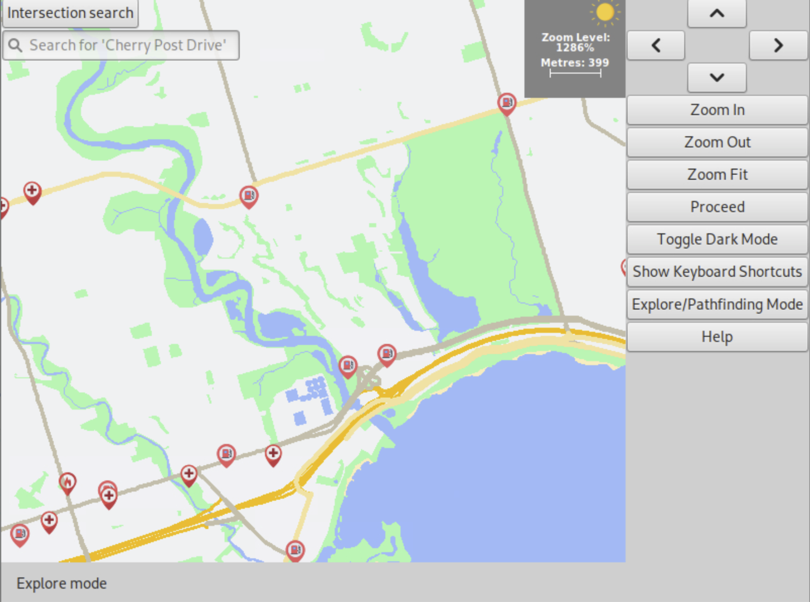

> [!NOTE]
> This project was developed for the course ECE297: Software Design and Communication at the University of Toronto. Students are encouraged to post a demo of their program, but are not allowed to post source code to prevent plagiarism.

# GreenWay

## Developed by Sadman Hossain, Danish Islam and Manik Sharma

# Description
In the most recent climate change survey from the Environment and Energy Division of the City of Toronto [1]:
* 78% of residents are concerned about the impact of climate change in Toronto
* 82% of residents are concerned about the impacts of climate change on the rest of the world

Although currently popular mapping applications such as Google Maps and Apple Maps have broad functionality, with residents of urban cities becoming more environmentally conscious, it is clear there is a need for a GIS that targets users who want to explore urban cities in the most environmentally friendly way.

Our team aimed to create a map that promotes environmental sustainability in urban cities by:
1. Highlighting local green spaces
2. Car routes to reduce carbon emissions 
3. Environmentally friendly ways to get around the city (Trails, Public Transportation, Bike Lanes)

# Features
## Environmentalism-Focused Features
### Green Space Explorer in Urban Cities

### Navigation For "Greenest" Car Routes
#### Point to Point Navigation
Click between two points to find path:

Type in two intersections to find path:

#### Travelling Salesman Problem
To fill out...
### Focus on Environmentally Friendly Commuting
Subway routes: 
 
Bike routes: 

## General GIS Features
### Zoom Level

### Dialogue Boxes

### Search Bar

### Keyboard Shortcuts

### Colour coded elements (e.g. water, greenspace, different road types)

### Night Mode

# References
1. M. Hrobsky and L. Eskin, “City of Toronto Climate Change Perceptions Research,” Ipsos, 2022. [Online]. Available: https://www.toronto.ca/wp-content/uploads/2022/03/96f2-City-of-TorontoClimate-Change-Report-FINAL.pdf. [Accessed: 28-Apr-2023].
