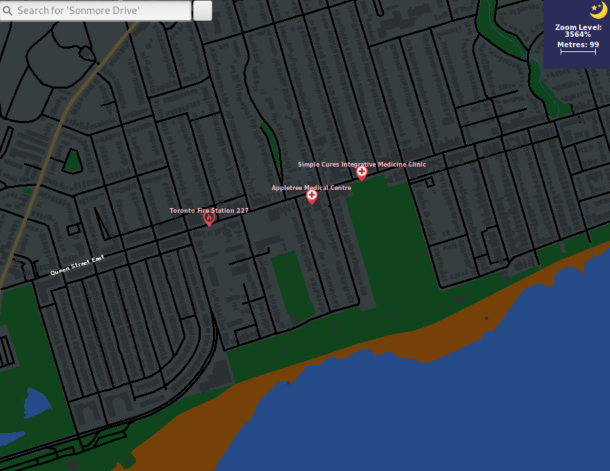

> [!NOTE]
> This project was developed for the course ECE297: Software Design and Communication at the University of Toronto. Students are encouraged to post a demo of their program, but are not allowed to post source code to prevent plagiarism.

# GreenWay

## Developed by Sadman Hossain, Danish Islam and Manik Sharma

# Description
In the most recent climate change survey from the Environment and Energy Division of the City of Toronto [1]:
* 78% of residents are concerned about the impact of climate change in Toronto
* 82% of residents are concerned about the impacts of climate change on the rest of the world

Although currently popular mapping applications such as Google Maps and Apple Maps have broad functionality, with residents of urban cities becoming more environmentally conscious, it is clear there is a need for a GIS that targets users who want to explore urban cities in the most environmentally friendly way.

Our team aimed to create a map that promotes environmental sustainability in urban cities by:
1. Highlighting local green spaces
2. Car routes to reduce carbon emissions 
3. Environmentally friendly ways to get around the city (Trails, Public Transportation, Bike Lanes)

# Features
## Environmentalism-Focused Features
### Green Space Explorer in Urban Cities

### Navigation For "Greenest" Car Routes
#### Point to Point Navigation
Click between two points to find path: 

Type in two intersections to find path: 

#### Travelling Courier Problem
This course required our codebase to have an API for the Travelling Courier problem. The Travelling Courier problem involves the following:
1. A courier company has M depots, where the truck driver can start their day at any depot and finish at any depot.
2. The truck needs to make N deliveries, with each delivery having a pickup location and a drop-off location. Drop-offs can happen in any order.
3. The objective is to find the optimal route that takes the least time to make all the deliveries.

The API was tested with test cases developed by the ECE297 team, with tests ranging from 5 deliveries to up to 200 deliveries.

Our team built a robust solution based on a modified version of the multi-destination Dijkstra's algorithm with multi-start, where we test different start points in the given time interval for computation.

### Focus on Environmentally Friendly Commuting
Subway routes: 
 
Bike routes: 

## General GIS Features
### Zoom Level

### Dialogue Boxes

### Search Bar

### Keyboard Shortcuts

### Colour coded elements (e.g. water, greenspace, different road types)

### Night Mode

# References
1. M. Hrobsky and L. Eskin, “City of Toronto Climate Change Perceptions Research,” Ipsos, 2022. [Online]. Available: https://www.toronto.ca/wp-content/uploads/2022/03/96f2-City-of-TorontoClimate-Change-Report-FINAL.pdf. [Accessed: 28-Apr-2023].
